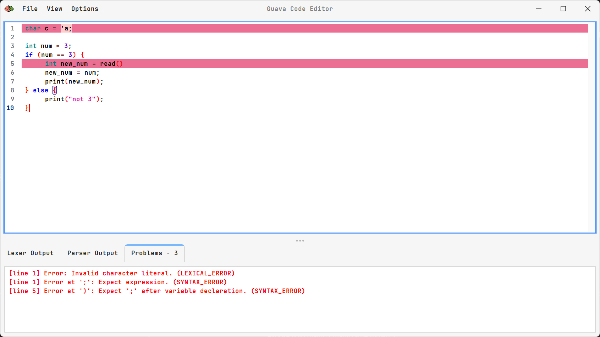

# Guava Language

Guava is a static, Java-based language designed to modernize GUI development by overcoming the limitations of Java Swing. It integrates CSS-like styling and advanced layout controls, enabling developers to create visually appealing and responsive UIs with a declarative approach

Guava simplifies GUI development by reducing syntax complexity and verbosity. It offers modern styling, eliminates redundancies, and ensures compatibility with Java frameworks, making it accessible for both experienced developers and beginners.

> **Note:** Guava is not a fully working programming language. Currently, we only have the lexer and parser components implemented.

## Features

- **Lexer**: Scans the source code and converts it into a list of tokens.
- **Parser**: Parses the list of tokens into an Abstract Syntax Tree (AST).
- **AST Generator**: Generates the `Stmt` and `Expr` classes, along with their corresponding visitor interfaces.
- **Visitor Pattern**: Used to traverse the AST and perform operations on its nodes.
- **Code Editor**: Provides a graphical user interface for editing Guava code with features like syntax highlighting, auto-completion, and error highlighting.

## 📸 Screenshots




## 👥 Group Members

- Abainza, Rendel
- de Dios, Wendel
- Dela Cruz, Juan Gabriel
- Estonilo, Julius Evan
- Osana, Lester
- Viado, John Paul

## 🚀 Getting Started

### Prerequisites

Before you begin, ensure you have the following installed:

- **Java Development Kit (JDK)** (version 17 or higher) [Download JDK](https://www.oracle.com/java/technologies/downloads/#jdk17-windows)
- **Maven** (for building the application) [Download Maven](https://maven.apache.org/download.cgi)
- **Git** (to clone the repository) [Download Git](https://git-scm.com/downloads)

---

### 1. Clone the Repository

Clone the repository to your local machine:

```bash
git clone https://github.com/Viadsss/GuavaLanguage.git
cd GuavaLanguage
```

---

### 2. Run the Application

Compile and run the application in your IDE (e.g., NetBeans or VS Code). After that, you can run the Guava language in three different modes:

1. **Interactive REPL**: Enter commands directly.
2. **Load and Execute a File**: Provide a file path.
3. **Open the Guava Code Editor**: Use the integrated code editor.

## 🤝 Contributing

If you're a collaborator on this repository, follow these steps to contribute:

1. **Clone the Repository & Setup:** (if you haven’t already):

   ```bash
   git clone https://github.com/Viadsss/GuavaLexTax.git
   cd GuavaLexTax
   ```

2. **Pull the Latest Changes**:
   Make sure your main branch is up to date:

   ```bash
   git checkout main
   git pull origin main
   ```

3. **Create a New Branch**:
   Create a new branch for your changes:

   ```bash
   git checkout -b your-branch-name
   ```

4. **Make Changes**:
   Make your changes on the new branch.

5. **Commit Changes**:
   After making changes, commit them:

   ```bash
   git add [file/s]
   git commit -m "message"
   ```

6. **Push Changes**:
   Push your changes to the new branch:

   ```bash
   git push origin your-branch-name
   ```

7. **Create a Pull Request**:
   Go to the repository on GitHub and create a pull request to merge your changes into the main branch.

## Project Structure

```markdown
.
├── .gitignore
├── .vscode/
│ ├── settings.json
├── derivations/
│ ├── declarations/
│ │ ├── funcDecl.ebnf
│ │ ├── mainDecl.ebnf
│ │ ├── nativeDecl.ebnf
│ │ ├── varDecl.ebnf
│ ├── iteratives/
│ │ ├── doWhileLoopStmt.ebnf
│ │ ├── forLoopStmt.ebnf
│ │ ├── whileLoopStmt.ebnf
│ ├── statements/
│ │ ├── block.ebnf
│ │ ├── exprStmt.ebnf
│ │ ├── ifStmt.ebnf
│ │ ├── printStmt.ebnf
│ │ ├── returnStmt.ebnf
├── guava.ebnf
├── guava5.ebnf
├── pom.xml
├── README.md
├── Sample Code/
│ ├── [1] - Comp.gv
│ ├── [2] - Style.gv
│ ├── [3] - Event.gv
│ ├── [4] - SimpleGUI.gv
│ ├── [5] - facebook.gv
├── src/
│ ├── main/
│ │ ├── java/
│ │ │ ├── com/
│ │ │ │ ├── guava/
│ │ │ │ │ ├── AstGenerator.java
│ │ │ │ │ ├── AstPrinter.java
│ │ │ │ │ ├── Expr.java
│ │ │ │ │ ├── Guava.java
│ │ │ │ │ ├── GuavaEditor.java
│ │ │ │ │ ├── Lexer.java
│ │ │ │ │ ├── Parser.java
│ │ │ │ │ ├── Stmt.java
│ ├── test/
├── target/
│ ├── classes/
│ ├── test-classes/
```
